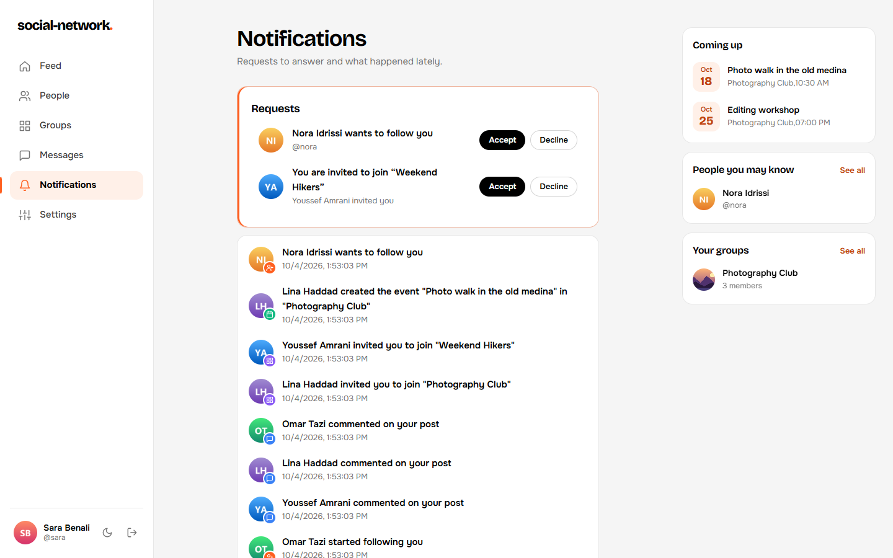

# Social Network

A Facebook-like social network: profiles, followers, posts with privacy levels, comments and reactions, groups with events, real-time private and group chat, and live notifications.

- **Backend:** Go 1.25, SQLite (`mattn/go-sqlite3`), `golang-migrate`, `gorilla/websocket`, bcrypt
- **Frontend:** Next.js 16 (App Router), React 19, plain CSS
- **Reverse proxy:** Caddy 2
- **Deployment:** Docker Compose

The full API reference and the sequence diagrams live in [backend/readme.md](backend/readme.md).

---

## Table of contents

1. [Screenshots](#screenshots)
2. [Features](#features)
3. [Project structure](#project-structure)
4. [Getting started](#getting-started)
5. [How the pieces talk to each other](#how-the-pieces-talk-to-each-other)
6. [Backend](#backend)
7. [Database](#database)
8. [API overview](#api-overview)
9. [WebSocket protocol](#websocket-protocol)
10. [Frontend](#frontend)
11. [Security notes](#security-notes)
12. [Resetting data](#resetting-data)

---

## Screenshots

| Feed | Comments and reactions |
|---|---|
|  |  |
| **Profile** | **Notifications** |
|  |  |
| **Groups** | **Group page** |
|  |  |
| **Private chat** | **Log in** |
|  |  |

---

## Features

| Area | What you can do |
|---|---|
| **Accounts** | Register (email, password, first/last name, date of birth, optional nickname, about me and avatar), log in, log out. Sessions use cookies. |
| **Profiles** | Public or private profiles. A profile shows the user's info, posts, followers and following. You can switch your own profile between public and private. |
| **Followers** | Following a public profile works right away. Following a private profile sends a follow request that the owner accepts or declines. |
| **Posts** | Text, images, or both (up to 3 JPEG/PNG/GIF images). Three privacy levels: `public` (everyone), `almost_private` (your followers), `private` (only the followers you pick). You can edit and delete your own posts. |
| **Comments and reactions** | Comment with text, images, or both on any post you can see. React with like or dislike: the same reaction again removes it, the other one switches it. |
| **Groups** | Create a group with a title, description and avatar. Invite members, or ask to join and let the creator accept. Group posts, comments, events and a group chat are visible to members only. The creator can edit or delete the group and remove members. |
| **Events** | Members create events (title, description, date/time) and answer `going` / `not_going`. They can change their answer later. |
| **Chat** | Real-time private messages between users when at least one of them follows the other. Group chat for members. Image attachments and a "typing…" indicator. |
| **Notifications** | Stored and pushed live: `comment_post`, `group_invitation`, `group_invite_response`, `group_join_request`, `group_join_response`, `group_removed`, `event_created`. |

---

## Project structure

```
social-network/
├── README.md                 ← this file
├── compose.yml               ← Docker Compose: backend + frontend + caddy
├── caddy/
│   ├── Caddyfile             ← Caddy config for running locally (127.0.0.1)
│   └── Caddyfile.docker      ← Caddy config inside Compose (service names)
├── backend/
│   ├── Dockerfile
│   ├── readme.md             ← full API reference + diagrams
│   ├── go.mod / go.sum
│   ├── cmd/server/main.go    ← entry point: opens the DB, runs migrations, starts :8080
│   └── internal/
│       ├── db/
│       │   ├── sqlite/sqlite.go        ← opens SQLite (WAL, foreign keys) + runs migrations
│       │   └── migrations/sqlite/*.sql ← numbered up/down migrations, embedded with go:embed
│       ├── server/server.go            ← every route is registered here
│       ├── middleware/                 ← auth (guest/authorized) + per-IP rate limit
│       ├── handler/                    ← HTTP parsing and responses, one package per area
│       ├── service/                    ← business rules and permission checks
│       ├── repository/                 ← SQL queries
│       ├── model/                      ← structs shared by all layers
│       └── websocket/                  ← hub, clients, typing relay, event publishing
└── frontend/
    ├── Dockerfile
    ├── next.config.js        ← dev rewrite: /api/v1/* → http://localhost:8080/*
    ├── app/
    │   ├── (auth)/login, (auth)/register
    │   └── (main)/home, profile/[id], people, groups, groups/[id],
    │              chat, chat/[id], notifications, settings
    ├── components/           ← PostCard, PostForm, Navbar, Modal, EventCard, …
    └── lib/                  ← api.js (fetch helpers), validate, unread, usePaged (lists 10 by 10)
```

Files created at runtime (ignored by git):

- `backend/sn.db`, `sn.db-wal`, `sn.db-shm`: the SQLite database. The server creates them on its first start.
- `backend/uploads/`: uploaded images, one file per upload, named by a random ID.

---

## Getting started

### Option 1: Docker Compose (recommended)

Requirements: Docker with the Compose plugin.

```bash
docker compose up --build
```

Then open **http://localhost:8000**.

| Service | Container | Port | Notes |
|---|---|---|---|
| `caddy` | social-network-caddy | host `8000` → 80 | The only service reachable from outside |
| `frontend` | social-network-frontend | 3000 (internal) | `next start` |
| `backend` | social-network-backend | 8080 (internal) | Go API + WebSocket |

Data is kept in named volumes: `backend-data` (the SQLite DB) and `backend-uploads` (images). `docker compose down` keeps them, and `docker compose down -v` deletes them.

### Option 2: Run locally (development)

Requirements: **Go 1.25+** with a C compiler, because `go-sqlite3` needs CGO. On Windows use MinGW/TDM-GCC; on Linux, `build-essential`. You also need **Node.js 22+**.

**1. Backend** (terminal 1)

```bash
cd backend
go run ./cmd/server
```

It listens on `:8080`. On the first start it creates `sn.db` in `backend/` and applies every migration.

**2. Frontend** (terminal 2)

```bash
cd frontend
npm install
npm run dev
```

Open **http://localhost:3000**. `next.config.js` rewrites `/api/v1/*` to `http://localhost:8080/*`. The WebSocket connects straight to `ws://localhost:8080/ws` when the page is served on port 3000 (see `socketUrl()` in [frontend/lib/api.js](frontend/lib/api.js)).

**Optional: go through Caddy locally**

```bash
caddy run --config caddy/Caddyfile
```

Caddy listens on `:80`. It forwards `/api/v1/*` to `127.0.0.1:8080` without the prefix, and everything else to `127.0.0.1:3000`.

---

## How the pieces talk to each other

```
Browser
   │
   ▼
Caddy (:80)
   ├── /api/v1/*  ──(strips /api/v1)──▶  Go backend (:8080)  ──▶  SQLite (sn.db)
   │                                          │                  uploads/ on disk
   │                                          └── /ws  WebSocket hub
   └── everything else  ─────────────────▶  Next.js (:3000)
```

- The backend's routes have **no prefix** (`/login`, `/posts`, …). Caddy, or the Next.js rewrite in dev, adds and removes `/api/v1`.
- The frontend always calls `/api/v1/...` with `credentials: 'include'`, so the session cookie goes along with every request.
- Form data is sent as `application/x-www-form-urlencoded`, and file uploads as `multipart/form-data`. Responses are JSON.

---

## Backend

### Layers

```
middleware  →  handler  →  service  →  repository  →  SQLite
                              ▲
websocket hub ────────────────┘ (publishes events; talks to the repository for chat)
```

| Layer | Folder | Job |
|---|---|---|
| middleware | `internal/middleware` | `RateLimit` (per IP, 1000 requests/minute; `/login` and `/register` also have their own limit of 10/minute; answers 429 with `Retry-After`). `SecurityHeaders` (nosniff, no framing, same-origin referrer). `Guest` / `Authorized` read the `session` cookie and put the user ID in the request context. |
| handler | `internal/handler/*handler` | Parses path, form and multipart input, calls the service, writes the JSON and status code |
| service | `internal/service/*svc` | Business rules: privacy, follow checks, group membership, validation |
| repository | `internal/repository` | All SQL. One file per area. |
| model | `internal/model` | Plain structs (User, Post, Group, Message, …) |
| websocket | `internal/websocket` | Keeps the connected clients per user, relays messages, typing events and notifications |

### Startup ([backend/cmd/server/main.go](backend/cmd/server/main.go))

1. `sqlite.InitDB("sn.db")` opens the DB with `foreign_keys = ON`, `journal_mode = WAL` and `busy_timeout = 5000`.
2. The embedded migrations run with `golang-migrate`. If the DB is already up to date, that's fine.
3. The routes are registered in [internal/server/server.go](backend/internal/server/server.go), wrapped in the rate limiter, and served on `:8080`.

### Authentication

- A session is a random 32-byte token, stored in the `sessions` table, that expires after 30 days.
- The cookie is named `session`, with `HttpOnly` and `SameSite=Lax`. No JWT is used.
- Passwords are hashed with bcrypt.
- `/register` and `/login` are guest-only. Every other route needs a valid session.
- Logging out deletes the session and closes that session's WebSocket connections.

### File uploads

- Post, group-post, comment and HTTP message creation accept text, images, or both in one multipart request; at least one is required, with up to 3 images. Avatars use the dedicated `/avatar` and `/groups/{group_id}/avatar` routes.
- Every image is checked before any of them is saved: the type is detected from the first 512 bytes (never from the file name), then the image header is decoded to prove it really is that format, and pictures wider or taller than 8000 px are refused. The frontend runs the same checks when a file is picked.
- Posts, comments and messages can each hold at most 3 images. Images can only be attached to content you own.
- The original file is saved to `uploads/<id>`, and its metadata goes into the `files` table.
- Deleting an owner or attached post, comment or message preserves the file row and clears the matching foreign key, leaving orphan metadata for future garbage collection.
- `GET /fs/{id}` serves the file only if you are allowed to see the post, message, avatar or group it belongs to. The response is cached privately with `immutable`.

---

## Database

The database is SQLite and lives in a single file, `backend/sn.db`. WAL mode adds `sn.db-wal` and `sn.db-shm` next to it. **You never create it by hand.** The server creates it and runs the migrations every time it starts.

### Migrations

They are in `backend/internal/db/migrations/sqlite/`. Each change has a numbered `.up.sql` / `.down.sql` pair, and the files are embedded into the binary with `go:embed`.

| # | Migration |
|---|---|
| 000001 | create users |
| 000002 | create sessions |
| 000003 | create posts (+ post_visibility, comments) |
| 000004 | create follow_requests |
| 000005 | create groups, members, invitations, join requests |
| 000006 | create group events + responses |
| 000007 | create notifications + messages |
| 000008 | enforce message sender check |
| 000009 | create reactions |
| 000010 | create files |
| 000011 | add message_id to files |
| 000012–000015 | clean up stored file URLs (store IDs only, drop old image column) |
| 000016 / 000018 | add, then drop, post `type` |
| 000017 | fix the messages check constraint |
| 000019 | group avatar + cascade deletes |
| 000020 | create `user_view` with follower/following/post counts |
| 000021 | create `post_view` with author data and attached image IDs |
| 000022 | extend `post_view` with group name, viewer list for `almost_private` posts |

To change the schema, add a new pair such as `000023_<name>.up.sql` / `.down.sql`. Never edit a migration that has already been applied.

### Tables

| Table | Purpose |
|---|---|
| `users` | account + profile (`private` flag, `avatar` = file ID) |
| `sessions` | session tokens with expiry |
| `follow_requests` | follower → following, `status` = `pending` / `accepted` |
| `posts` | user or group posts with `privacy` |
| `post_visibility` | the chosen followers for `private` posts |
| `comments` | comments on posts |
| `reactions` | one like/dislike per user per post |
| `groups`, `group_members` | groups and their members |
| `group_invitations`, `group_join_requests` | pending invites and requests |
| `group_events`, `event_responses` | events and going / not going answers |
| `notifications` | stored notifications, also pushed live |
| `messages` | private (`to_user_id`) or group (`group_id`) messages. Exactly one of them is set. |
| `files` | uploaded image metadata, linked to a post or message |

The migrations are the only definition of the database: the server applies the missing ones at every start, so there is no separate schema file to keep in sync.

---

## API overview

Every path below is relative to the backend. From the browser, add the `/api/v1` prefix. Request and response details are in [backend/readme.md](backend/readme.md).

| Area | Routes |
|---|---|
| Auth | `POST /register`, `POST /login`, `POST /logout`, `GET /me` |
| Users | `GET /users`, `GET /users/suggestions`, `GET /user/{id}`, `GET /users/{id}/posts`, `GET /users/{id}/followers`, `GET /users/{id}/following`, `PUT /me/privacy` |
| Follows | `POST/DELETE /users/{id}/follow`, `POST /follow-requests/{id}/accept`, `POST /follow-requests/{id}/decline` |
| Notifications | `GET /requests` (follow requests, invitations and join requests in one response), `GET /notifications`, `GET /notifications/unread`, `POST /notifications/read` |
| Posts | `GET/POST /posts`, `GET/PUT/DELETE /posts/{id}` |
| Comments | `GET/POST /posts/{id}/comments` |
| Reactions | `POST/DELETE /posts/{id}/reactions` |
| Files | `POST /avatar`, `GET /fs/{id}` |
| Groups | `GET/POST /groups`, `GET/PUT/DELETE /groups/{group_id}`, `POST /groups/{group_id}/avatar`, `GET /groups/{group_id}/members`, `DELETE /groups/{group_id}/members/{userID}` |
| Invitations | `POST /groups/{group_id}/invitations`, `GET /group-invitations`, `POST /group-invitations/{id}/accept`, `POST /group-invitations/{id}/decline` |
| Join requests | `POST/GET /groups/{group_id}/join-requests`, `POST /group-join-requests/{id}/accept`, `POST /group-join-requests/{id}/decline` |
| Group posts | `GET/POST /groups/{group_id}/posts`, `PUT/DELETE /groups/{group_id}/posts/{post_id}` |
| Events | `GET/POST /groups/{group_id}/events`, `GET /events/upcoming`, `POST /events/{id}/response` |
| Messages | `GET /messages/{id}`, `GET /groups/{group_id}/messages`, `POST /messages`, `POST /messages/{id}/images` |
| Realtime | `GET /ws` |

Every list that can grow comes 10 at a time: the feed, profile posts, group posts, comments (newest first), users (with `?q=` search), followers, following, contacts, notifications, groups (`?joined=true|false`), group members, group events, invitations, join requests and the lists in `/requests` (`?type=`). Chat history comes 10 at a time too, newest first: scroll up for older messages. Ask for the next page with `?last=<id>`, the id of the last item you already have: the page starts right after it, so items added at the top in the meantime never shift it. A page with fewer than 10 items is the last one.

Errors come back as a plain-text body with the matching status code: `400` for invalid input, `401` when you are not logged in, `403` when you are not allowed, `404` when something is not found or you can't see it, `409` for duplicates, and `429` when you hit the rate limit.

---

## WebSocket protocol

Connect to `GET /ws` with the session cookie. One socket carries chat, typing and notifications.

**Client → server**

```json
{ "type": "message", "to_user_id": 2, "content": "hi" }
{ "type": "message", "group_id": 5,   "content": "hello group" }
{ "type": "message", "to_user_id": 2, "content": "photo", "client_id": "upload-1" }
{ "type": "typing",  "to_user_id": 2 }
{ "type": "typing",  "group_id": 5 }
```

Set exactly one of `to_user_id` or `group_id`. Messages are saved. Typing events are only passed on, never saved. Both go through the same permission check: in a private chat one of the two users must follow the other, and in a group chat you must be a member.

**Server → client**

```json
{ "type": "message",      "message": { "id": 1, "from_user_id": 1, "to_user_id": 2, "content": "hi", ... } }
{ "type": "typing",       "from_user_id": 1, "group_id": 5 }
{ "type": "notification", "notification": { "type": "group_invitation", ... } }
{ "type": "error",        "error": "message is not permitted" }
{ "type": "message_created", "client_id": "upload-1", "message_id": 7 }
```

Private messages are sent to both the sender and the recipient. Group messages are sent to every member.

Set `client_id` only when pictures follow. The sender receives `message_created`, then uploads them to `POST /messages/{message_id}/images` as multipart HTTP. This keeps chat events real-time while images use streamed HTTP uploads. The connection has a 64 KB read limit and a 60-second read deadline that each pong resets.

---

## Frontend

The frontend is a Next.js App Router app written in plain JavaScript and CSS ([frontend/app/globals.css](frontend/app/globals.css)). Every page is a client component.

| Route | Page |
|---|---|
| `/` | redirects to `/home` |
| `/login`, `/register` | auth pages (`(auth)` layout) |
| `/home` | feed + post composer |
| `/profile/[id]` | profile, posts, followers/following, follow button |
| `/people` | every user, to find people to follow |
| `/groups`, `/groups/[id]` | group list; group page with posts, events, members, chat |
| `/chat`, `/chat/[id]` | conversation list; a private chat |
| `/notifications` | live notifications with accept/decline actions |
| `/settings` | profile privacy, avatar |

- The `(main)` layout calls `GET /me`. If that fails it redirects to `/login`; otherwise it shows the navbar.
- [lib/api.js](frontend/lib/api.js) provides `apiGet`, `apiPost`, `apiPut`, `apiDelete`, `apiUpload`, `imageUrl(id)` and `socketUrl()`.
- [lib/validate.js](frontend/lib/validate.js) checks form input on the client. The backend checks it again.
- [lib/unread.js](frontend/lib/unread.js) tracks which conversations have unread messages.

Scripts: `npm run dev`, `npm run build`, `npm run start`, `npm run lint`.

---

## Security notes

- Every route except register and login needs a session, and every read goes through a visibility check: post privacy, private profiles, group membership and file ownership. Group post images are for members only.
- All SQL uses parameterized queries.
- Register checks every field (lengths, 8–72 character password, unique email and nickname). The avatar can only be set by uploading one.
- A failed login takes the same time whether the account exists or not.
- Uploads are limited by size, count, detected type and pixel size, and are never served as a public static folder. `GET /fs/{id}` answers with `nosniff` and a sandbox CSP, so a file can never run as a page.
- The session cookie is `HttpOnly` and `SameSite=Lax`.
- The WebSocket only accepts pages from the same host, or from `ALLOWED_ORIGINS` (default: the Next dev server on port 3000). Chat messages are limited to 1000 characters on both HTTP and the socket.
- Each IP is rate-limited: 1000 requests/minute, and 10/minute on login and register. Behind Caddy the real client IP is read from `X-Forwarded-For`.
- The server has read and idle timeouts, and both the API and the frontend send `X-Content-Type-Options`, `X-Frame-Options` and `Referrer-Policy` headers.

---

## Resetting data

To start with an empty database, stop the backend and delete the DB files. They are recreated on the next start.

```bash
# local
rm backend/sn.db backend/sn.db-wal backend/sn.db-shm
rm -rf backend/uploads      # optional: uploaded images

# docker
docker compose down -v
```
