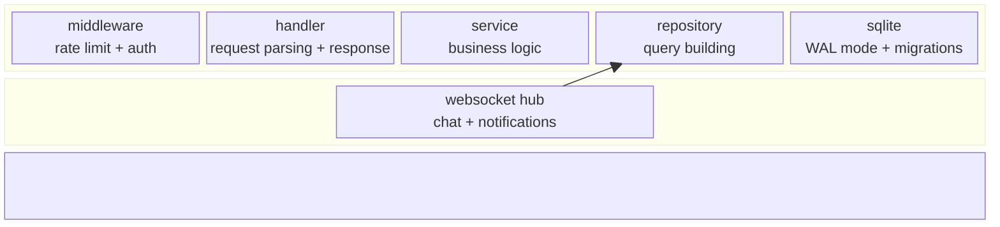
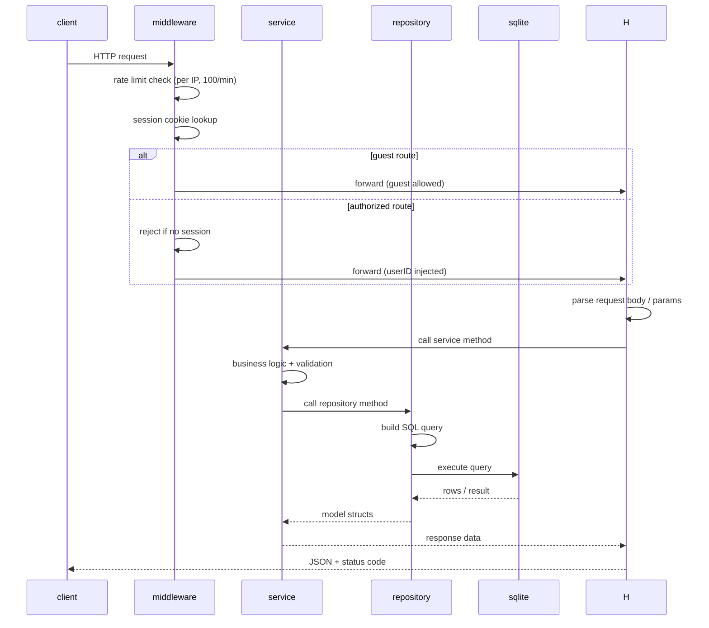
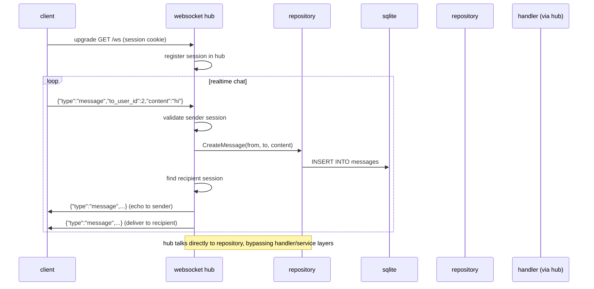
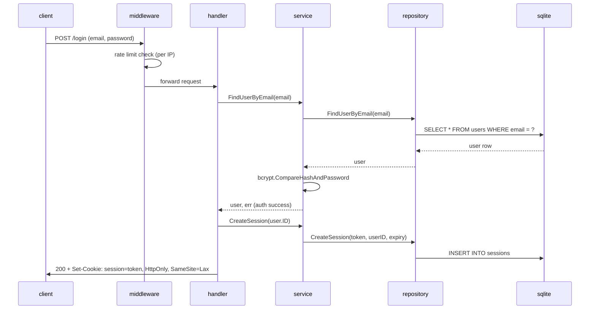
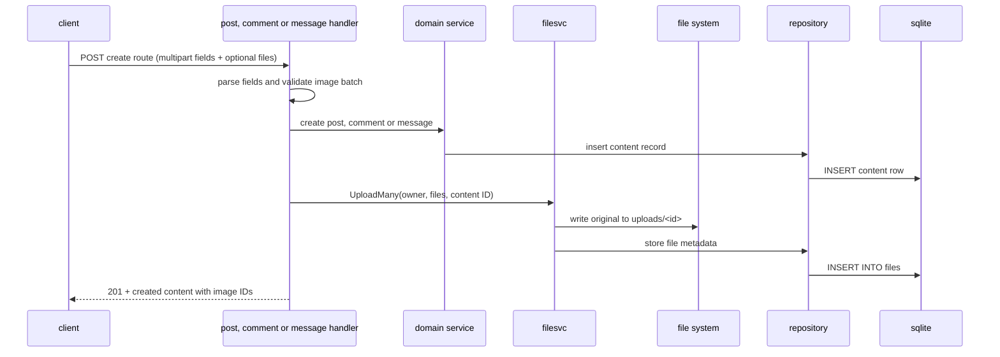
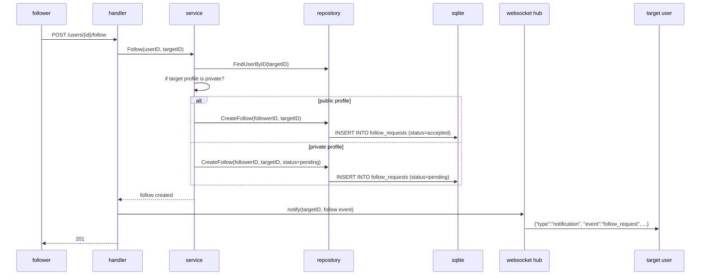
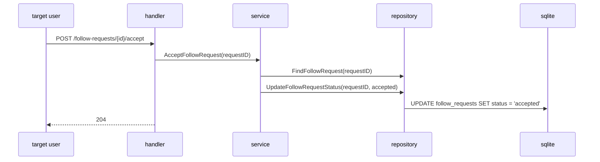
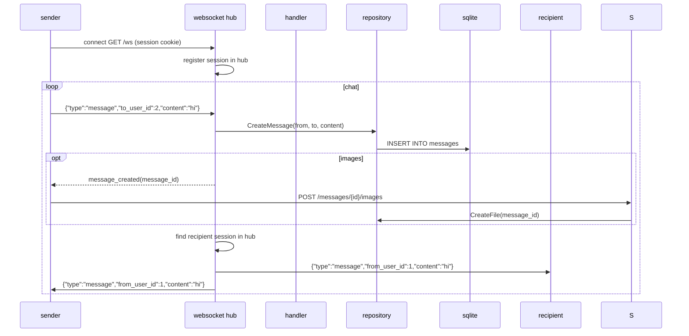
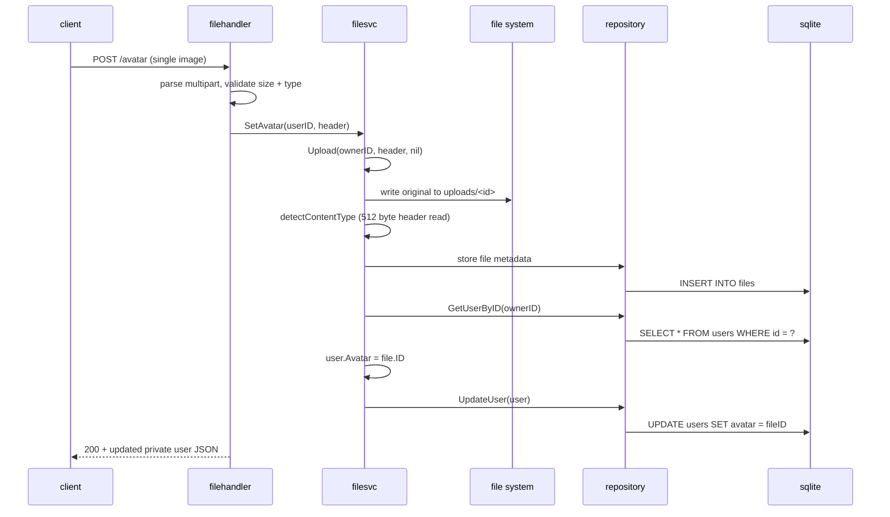

## INTRODUCTION
This is the API backend for the social network project. It serves the authenticated REST routes, handles session cookies, and exposes the realtime WebSocket events used by the Next.js frontend.

## how to run
From the repository root:

```bash
docker compose up --build
```

This brings up the backend, frontend, and Caddy reverse proxy. The Go API listens on :8080 internally and creates the SQLite database at `backend/sn.db` on first start, running all embedded SQL migrations automatically.

For local development without Docker:

```bash
cd backend
go run ./cmd/server
```

The API is normally exposed through Caddy or the frontend dev server as `/api/v1/*`, while the backend itself listens on plain routes such as `/login`, `/posts`, and `/ws`.

## endpoints (/api/v*/ prefix shall be added using caddy)
`/register` and `/login` are guest-only. Every other route requires a valid `session` cookie.

### auth
| method | path | request | response |
|---|---|---|---|
| POST | /register | form: email, password, first_name, last_name, date_of_birth, nickname, about_me, avatar | 201 + private user json, logs you in right away |
| POST | /login | form: email, password | 200 + private user json |
| POST | /logout | - | deletes the session, clears the cookie and force closes that session's websockets |
| GET | /me | - | current user (private shape: adds email and date_of_birth to the public one) |

### users & follows
| method | path | request | response |
|---|---|---|---|
| GET | /users | query: q (search by name or nickname), last | 10 users except you, public shape, ordered by name |
| GET | /contacts | query: last | 10 users you can message (at least one of you follows the other, accepted), newest conversation first, then by name |
| GET | /user/{id} | - | profile with post_count, followers, following and your follow state (is_followed / is_following: 0 none, 1 accepted, 2 pending); a private profile you don't follow leaves out email and date_of_birth |
| GET | /users/{id}/posts | query: last | 10 of their posts you may see, same privacy gate as the profile |
| GET | /users/suggestions | - | up to 4 users you have no accepted follow with either way, for "People you may know" |
| GET | /users/{id}/followers | query: last | 10 users following them, same privacy gate as the profile |
| GET | /users/{id}/following | query: last | 10 users they follow, same privacy gate as the profile |
| POST | /users/{id}/follow | - | follows the user, or creates a follow request if their profile is private |
| DELETE | /users/{id}/follow | - | unfollows |
| GET | /requests | query: type, last | {follow_requests: [{id, created_at, user}], group_invitations, group_join_requests}: the first 10 of each list waiting for you to accept or decline. With type=follow_requests\|group_invitations\|group_join_requests and last, the next 10 of that list only, as an array |
| POST | /follow-requests/{id}/accept | - | 204 |
| POST | /follow-requests/{id}/decline | - | 204 |
| PUT | /me/privacy | form: private = true \| false | 200 + private user json, turns your own profile public or private; going public accepts every pending follow request |

### posts
| method | path | request | response |
|---|---|---|---|
| GET | /posts | query: last | 10 posts visible to you, newest first |
| POST | /posts | form: content, privacy = public \| almost_private \| private, viewers = user id (repeat it; required for private, each must follow you) | 201 + post json |
| PUT | /posts/{id} | form: content, privacy, viewers (optional, replaces the chosen followers), attachments (repeat file IDs to keep; omit to leave unchanged, send empty to remove all) | 200 + post json, only the owner can update |
| DELETE | /posts/{id} | - | 204, only the owner can delete |
| POST | /posts/{id}/reactions | form: reaction = like \| dislike | 200 + summary, toggles: same reaction removes it, other switches; invisible post = 404 |
| DELETE | /posts/{id}/reactions | - | 200 + summary after removing your reaction |
| GET | /posts/{id} | - | one post, 404 if you cannot see it |
| GET | /posts/{id}/comments | query: last | 10 comments, newest first; last = id of the oldest you have gives the ones before it. Visibility follows the post |
| POST | /posts/{id}/comments | form: content | 201 + comment json |

Post json includes `likes`, `dislikes` (aggregate counts) and `my_reaction` (`like`, `dislike`, or empty) for the requesting user.

### groups
| method | path | request | response |
|---|---|---|---|
| POST | /groups | form: title, description | 201 + group json, creator joins the group automatically |
| GET | /groups | query: joined (true = yours, false = the others, empty = all), last | 10 groups, newest first, with member_count, is_member, pending_join, is_creator for you |
| GET | /groups/{group_id} | - | group (with avatar) + creator + the first 10 members + member_count, event_count + your status; outsiders get the header with an empty member list |
| PUT | /groups/{group_id} | form: title, description | 200 + group json, creator only |
| DELETE | /groups/{group_id} | - | 204, creator only; members, invitations, requests, posts, comments, events, messages and notifications are deleted by the database cascade |
| POST | /groups/{group_id}/avatar | multipart: avatar | 200 + group json, creator only, same image rules as /avatar |
| GET | /groups/{group_id}/members | query: last (a member's user_id) | 10 members in joining order, members only (403 otherwise) |
| DELETE | /groups/{group_id}/members/{userID} | - | 204, the creator removes a member, or a member removes themselves to leave; the creator cannot be removed; the user can be invited again later |
| GET | /groups/{group_id}/messages | optional `last` oldest loaded message id | 10 newest messages before `last`, each with from_first_name, from_last_name, from_avatar; members only (new ones arrive over /ws) |
| POST | /groups/{group_id}/invitations | form: user_id | 201 + invitation json, members only; rejects self-invites, unknown users, existing members and duplicates (409) |
| GET | /group-invitations | query: last | 10 of your pending invitations, newest first |
| POST | /group-invitations/{id}/accept | - | 204, recipient only, joins atomically |
| POST | /group-invitations/{id}/decline | - | 204, recipient only |
| POST | /groups/{group_id}/join-requests | - | 201 + request json, non-members only; members/duplicates rejected |
| GET | /groups/{group_id}/join-requests | query: last | 10 pending requests, newest first, creator only |
| POST | /group-join-requests/{id}/accept | - | 204, group creator only, joins atomically |
| POST | /group-join-requests/{id}/decline | - | 204, group creator only |
| GET | /groups/{group_id}/posts | query: last | 10 group posts, newest first, members only |
| POST | /groups/{group_id}/posts | multipart: content, files (optional) | 201 + post json, members only |
| PUT | /groups/{group_id}/posts/{post_id} | form: content, attachments (optional) | 200 + post json, author only |
| DELETE | /groups/{group_id}/posts/{post_id} | - | 204, the post author or the group creator |
| GET | /groups/{group_id}/events | query: last | 10 group events, soonest first, with going_count, not_going_count and your my_choice, members only (the total is event_count on GET /groups/{group_id}) |
| POST | /groups/{group_id}/events | form: title, description, event_time | 201 + event json, members only |
| GET | /events/upcoming | - | your next 3 events across all your groups, soonest first, each with group_title |
| POST | /events/{id}/response | form: choice = going \| not_going, or empty to remove your answer | 200 + {my_choice, going_count, not_going_count}, one response per user |

Groups notifications (group_invitation, group_join_request, group_invite_response, group_join_response) are stored in the notifications table and pushed live over /ws with the standard `{"type":"notification", ...}` event.

### messages
| method | path | request | response |
|---|---|---|---|
| GET | /messages/{id} | optional `last` oldest loaded message id | 10 newest messages before `last` in your conversation, each with its sender's name and avatar |
| POST | /messages | form: to_user_id, content | 201 + message json, pushed to both sides over /ws |
| POST | /messages/{id}/images | multipart: files[] (max 3 images, 10 MB each) | 201 + completed message json, pushed to recipients over /ws |

At least one of the two users must follow the other, otherwise the message is rejected.

### files
| method | path | request | response |
|---|---|---|---|
| POST | /files | multipart: files[] or file (max 3 files, 10 MB each, jpeg/png/gif only), optional post_id or message_id to attach them to a post or chat message | 201 + stored file json |
| POST | /avatar | multipart: avatar (single image, same type/size limits) | 200 + private user json, sets your avatar |
| GET | /fs/{id} | - | serves the original file after a per user visibility check, 404 if you can't see it; `Cache-Control: private, max-age=31536000, immutable` (files are immutable content-addressed IDs, so browsers may cache privately) |

### websocket
| method | path | request | response |
|---|---|---|---|
| GET | /ws | upgrade | chat + notifications over one socket (gorilla/websocket) |

client sends {"type":"message", "to_user_id" or "group_id", "content", optional "client_id"} (exactly one target); client_id is sent only when pictures follow, and then the sender receives message_created with its id, then uploads multipart images to POST /messages/{id}/images
server sends back messages (echoed to the sender too), {"type":"notification", ...} events and {"type":"error", ...} for rejected input

## auth
cookie sessions, no jwt
a random 32 byte token stored in the sessions table with a 30 day expiry
cookie name is "session" (HttpOnly, SameSite=Lax)
passwords hashed with bcrypt

## rate limiting
every request goes through a per-IP limiter: 1000 requests per minute globally, with a stricter 10 requests per minute limit on `/login` and `/register`. When a client exceeds the limit, the server answers with `429 Too Many Requests` and includes `Retry-After`.

## database
sqlite (WAL mode, foreign keys on)
migrations are embedded with go:embed and run at startup using golang-migrate (internal/db/migrations/sqlite)
tables: users, sessions, posts, follow_requests, groups, group_members, group_invitations, group_join_requests, group events, notifications, messages (private + group), reactions, files

## architecture
we are using a layered architecture
(model, middleware, handler, websocket, service, repository, db)

request flow: middleware -> handler -> service -> repository -> sqlite
the websocket hub sits next to that stack and talks to the repository directly

The repository package exposes domain-specific types: `UserRepository`, `FollowRepository`, `PostRepository`, `ReactionRepository`, `CommentRepository`, `EventRepository`, `FileRepository`, `GroupRepository`, `MessageRepository`, `NotificationRepository`, and `SessionRepository`. `repository.New(db)` assembles them into a `Repositories` bundle over the shared database connection; services receive only the repositories they use.







## sequence diagrams

### login

Client authenticates with email/password. The middleware checks rate limits, the handler looks up the user, the service verifies the bcrypt hash, and a session cookie is set on success.



### images on creation

Post, group-post, comment and HTTP message forms send their fields and up to 3 images together as multipart data. The handler validates every image before creating the record, then stores the image bytes and metadata against that new record. Avatar uploads use dedicated avatar routes.



The app sends image-bearing messages through `POST /messages`; text-only chat messages can still use the WebSocket. `POST /messages/{id}/images` remains for clients that create a message over WebSocket first. `GET /fs/{id}` checks visibility before serving bytes.

### follow request flow

A user follows another user. If the target's profile is public, the follow is accepted immediately. If private, a pending follow request is created and the target user receives a real-time WebSocket notification.



### accept / decline follow request

The target user reviews a pending follow request and accepts or declines it. The repository updates the status in the `follow_requests` table.



### websocket messaging

Clients connect via WebSocket with a session cookie. The hub registers each session and routes messages directly through the repository, bypassing the handler/service layers. Messages are persisted and delivered to both the sender and recipient in real time.



### avatar upload

Client uploads a single image for their avatar. The service follows the same pipeline as post image uploads — sniffing the content type and writing the original to disk — then updates the `users.avatar` field to point to the new file.


